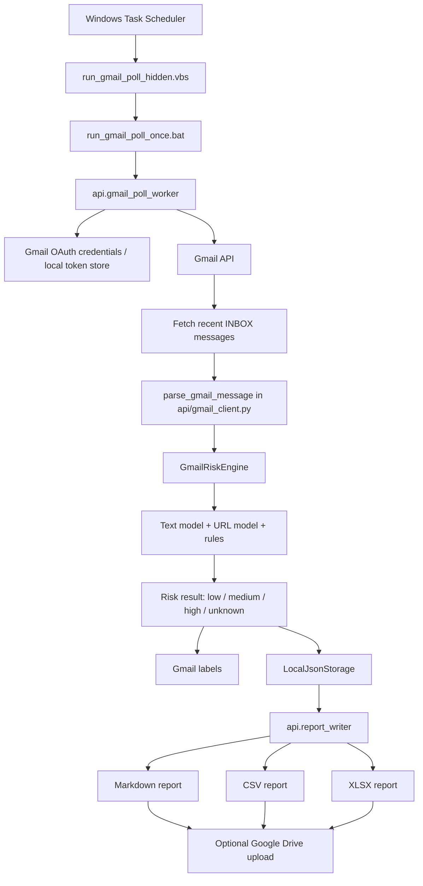

# Gmail Polling Architecture Mermaid Diagram

This diagram documents the actual submitted Gmail automation flow for Moodify / AI-Supported Cyber Project.

The diagram intentionally shows near-real-time scheduled local polling. It does not describe full Gmail push monitoring or a fully cloud-native Cloud Run/Pub/Sub deployment.
