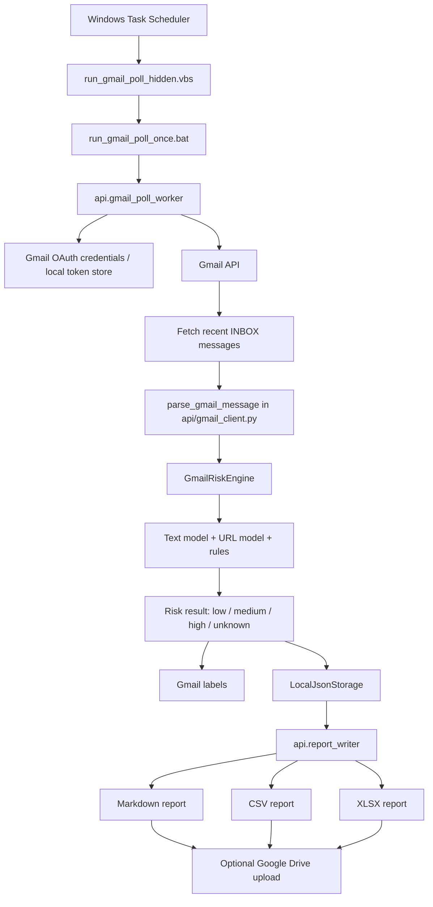

# Project Explanation for College Submission

## Title

**AI-Assisted Defensive Cybersecurity Mini-Project: Near-Real-Time Gmail Phishing Detection, URL Analysis, Log Triage, and Security Reporting**

## Abstract

This project is a defensive cybersecurity mini-project that combines ML-based phishing analysis, URL analysis, rule-based log triage, and Gmail security automation. The Gmail automation uses near-real-time local scheduled polling through Windows Task Scheduler. It uses the Gmail API and optional Drive API integration, not paid Pub/Sub/Cloud Run monitoring.

The system analyzes email text, extracted URLs, and sanitized log lines. It applies non-destructive Gmail labels for scanned, low, medium, high, and needs-review messages, then generates local Markdown, CSV, and XLSX reports. Reports can optionally be uploaded to Google Drive for backup/storage. FastAPI remains part of the local demo for text, URL, and log analysis with immediate prediction responses.

## Problem statement

Phishing messages, deceptive URLs, and suspicious web requests are common security problems. Beginners often study phishing detection only in notebooks, which does not show how a real defensive workflow would analyze messages, label risk, and summarize findings for review. This project solves that learning gap by creating a small working application with:

- Offline model training scripts.
- Saved local models.
- FastAPI prediction endpoints for text, URL, and log analysis.
- A browser frontend for local demos.
- A local log-file watcher.
- Near-real-time scheduled Gmail polling.
- Gmail labeling and local security reports.
- Optional Google Drive report upload.
- Responsible-use documentation.

## Objectives

The main objectives are:

1. Build a defensive-only phishing and log triage project.
2. Keep training separate from prediction.
3. Load trained models once at API startup.
4. Return immediate JSON results through FastAPI.
5. Provide understandable reasons for each prediction.
6. Demonstrate local real-time API predictions and watchdog sample-log monitoring.
7. Demonstrate near-real-time scheduled Gmail polling after user OAuth authorization.
8. Apply non-destructive Gmail labels instead of deleting or blocking messages.
9. Generate Markdown, CSV, and XLSX reports for human review.
10. Document limitations, privacy concerns, and responsible use.

## Scope

### Included

- Text/email phishing classification using TF-IDF and Logistic Regression.
- URL phishing classification using explainable URL features and Random Forest.
- Optional external URL checks using API keys from environment variables.
- Rule-based log triage for sanitized Apache/Nginx-style logs.
- Watchdog-based local sample-log monitoring.
- Simple HTML frontend.
- Near-real-time scheduled Gmail polling through a local Windows scheduler.
- Gmail API inbox scanning after explicit OAuth authorization.
- Safe parsing of plain-text and HTML email bodies.
- AI-Cyber Gmail labels for scanned, low, medium, high, needs-review, and manual feedback states.
- Local Markdown, CSV, and XLSX report generation.
- Optional Google Drive report upload through the Drive API.
- Responsible-use and limitation documentation.

### Not included

- No phishing generation.
- No credential collection.
- No exploitation or scanning.
- No unauthorized inbox access. Gmail polling works only after explicit OAuth authorization from the user.
- No full real-time Gmail push monitoring in the submitted version.
- No full cloud-native SOC deployment.
- No automatic deletion, forwarding, replying, or blocking of emails.
- No production deployment.
- No automatic blocking or enforcement actions.

## System architecture

The project has five major layers.

### 1. Offline training layer

Training scripts are stored in `train/`:

- `train/train_text_model.py`
- `train/train_url_model.py`

These scripts load sanitized datasets from `data/`, train models, evaluate them, and save model files into `models/`. Training is separate from prediction so the application can load saved models instead of retraining on every request.

### 2. Local FastAPI analysis layer

FastAPI code is stored in `api/`:

- `api/main.py`
- `api/text_analyzer.py`
- `api/url_analyzer.py`
- `api/log_analyzer.py`
- `api/features.py`
- `api/external_checks.py`

The API exposes:

- `GET /health`
- `POST /analyze-text`
- `POST /analyze-url`
- `POST /analyze-log-line`

The text and URL models are loaded once when the API starts. Prediction requests reuse the loaded models and do not retrain. This layer can provide real-time local prediction responses for pasted text, URLs, and sanitized log lines.

### 3. Near-real-time Gmail polling layer

The submitted Gmail workflow is near-real-time scheduled Gmail polling, not full real-time Gmail monitoring. The local scheduler periodically launches the Gmail polling worker after the user has completed OAuth authorization.

The working automation path is:

```text
Windows Task Scheduler
→ hidden VBS runner
→ batch file
→ local Gmail polling worker
→ Gmail API inbox scan
→ skip already scanned messages
→ parse plain-text and HTML email bodies safely
→ analyze text and URLs
→ apply AI-Cyber Gmail labels
→ generate Markdown, CSV, and XLSX reports
→ optionally upload reports to Google Drive
```

### Gmail polling architecture diagram

The following Mermaid diagram shows the actual submitted Gmail automation flow. It represents local scheduled polling, not full Gmail push monitoring and not a fully cloud-native Cloud Run/Pub/Sub deployment.



### 4. Gmail labeling and reporting layer

The Gmail response is intentionally non-destructive. Instead of deleting, forwarding, replying to, or blocking emails, the worker applies labels:

```text
AI-Cyber/Scanned
AI-Cyber/Low
AI-Cyber/Medium
AI-Cyber/High
AI-Cyber/Needs Review
AI-Cyber/False Positive
AI-Cyber/Confirmed Phishing
```

Reports are generated locally in Markdown, CSV, and XLSX formats. Google Drive upload is optional and is used only for report backup/storage, not as a full cloud security backend.

### 5. Optional future cloud layer

Cloud Run, Pub/Sub, and a fully cloud-native SOC-style deployment are future optional scope only. They are not the current submitted architecture. The final working Gmail automation uses local Windows scheduled polling with Gmail API access after user OAuth authorization.

## Near-real-time Gmail polling workflow

The Gmail automation workflow is:

```text
Windows Task Scheduler
→ hidden VBS runner
→ batch file
→ local Gmail polling worker
→ Gmail API inbox scan
→ skip already scanned messages
→ parse plain-text and HTML email bodies safely
→ analyze text and URLs
→ apply AI-Cyber Gmail labels
→ generate Markdown, CSV, and XLSX reports
→ optionally upload reports to Google Drive
```

The worker uses Gmail API access only after explicit OAuth authorization from the user. It skips already scanned messages, parses HTML emails as text without executing scripts or styles, analyzes suspicious links as indicators without opening them in a browser, and records results for human review.

The labels used by the submitted workflow are:

```text
AI-Cyber/Scanned
AI-Cyber/Low
AI-Cyber/Medium
AI-Cyber/High
AI-Cyber/Needs Review
AI-Cyber/False Positive
AI-Cyber/Confirmed Phishing
```

## Data used

The project includes small sanitized starter datasets:

- `data/phishing_dataset.csv` with `text,label` columns.
- `data/url_dataset.csv` with `url,label` columns.
- `data/sample_logs.log` with toy Apache/Nginx-style logs.

These datasets are for demonstration only. They are not large enough for production accuracy.

## Text phishing detection method

The text model uses:

- `TfidfVectorizer` to convert text into numeric features.
- `LogisticRegression` to classify text as `legitimate` or `phishing`.

The model is evaluated with:

- Accuracy.
- Precision.
- Recall.
- F1-score.
- Classification report.
- Confusion matrix.

Accuracy alone is not enough because phishing datasets can be imbalanced. Recall is important because missed phishing messages are dangerous, while precision matters because too many false positives can create alert fatigue.

## URL phishing detection method

The URL model uses structural features such as:

- URL length.
- HTTPS usage.
- IP address in hostname.
- Dot count.
- Hyphen count.
- `@` symbol presence.
- Suspicious keyword count.
- Subdomain depth.
- Domain length.
- Special character count.

A `RandomForestClassifier` is trained on these features. The API returns the extracted features so the prediction is easier to explain.

## External checks

Optional VirusTotal and PhishTank checks can provide supporting URL reputation evidence. These checks:

- Use environment variables for API keys.
- Are disabled unless `include_external_checks` is set to `true`.
- Return `skipped` when API keys are missing.
- Include privacy warnings.
- May disclose submitted URLs to third-party services.

External checks are supporting evidence only and should not replace human review.

## Log triage method

The log triage module is rule-based. It parses one Apache/Nginx-style log line and checks for:

- Sensitive paths such as `/admin`, `/wp-login`, and `/.env`.
- Repeated `404` responses.
- `401` and `403` statuses.
- Scanning-related file extensions.
- Many different paths requested by the same IP.
- Scanner or bot-like User-Agent text.

The output includes:

- Verdict.
- Risk score.
- Risk level.
- Reasons.
- Parsed log fields.

## Real-time functionality

This section uses real-time only for local FastAPI prediction responses and watchdog sample-log monitoring. Gmail automation is described as near-real-time scheduled Gmail polling.

## Real-time and near-real-time functionality

The project separates real-time local analysis from near-real-time Gmail automation.

### Level 1: Real-time API analysis

The user can paste text, URLs, or log lines into the frontend or API. FastAPI returns immediate JSON responses. The trained models are already loaded in memory and are not retrained during prediction.

### Level 2: Real-time sample-log monitoring

`monitor_logs.py` uses watchdog to watch a local sample log file. When a new line is appended, the script analyzes it and prints an alert if the risk level is medium or high.

### Level 3: Near-real-time scheduled Gmail polling

Windows Task Scheduler runs the local Gmail polling worker periodically. This gives practical near-real-time scheduled Gmail polling without paid cloud dependencies. It is not full real-time Gmail push monitoring.

## Security and privacy notes

- The project is defensive-only.
- Gmail access requires explicit user OAuth authorization.
- `credentials.json` is local-only and ignored by Git. Local OAuth tokens prefer OS credential storage through `keyring`; plaintext `token.json` is only a legacy fallback or migration source and is ignored by Git.
- Generated reports, logs, runtime files, local storage, and model artifacts should not be committed.
- HTML emails are parsed as text; scripts and styles must not be executed.
- Suspicious links are analyzed as indicators and should not be opened in a browser.
- Optional external threat-intelligence checks may disclose submitted URLs to third-party services.
- Human review is required before taking action.
- False positives and false negatives are expected because this is a student/demo system.


## Limitations

This is a student/demo cybersecurity system, not a production email security gateway or enterprise SOC platform. Important limitations include:

- Gmail automation uses near-real-time scheduled Gmail polling, not full real-time Gmail push monitoring.
- The submitted version is not a full cloud-native SOC deployment.
- The models use limited demo datasets and can produce false positives and false negatives.
- Gmail labels are assistive indicators and do not replace human review.
- Optional external checks may disclose submitted URLs to third-party services when enabled.
- Local machine security affects OAuth token, report, and runtime-file security.

## Future improvements

Possible future improvements include:

- More representative sanitized datasets and stronger evaluation metrics.
- Report encryption or protected archives for sensitive summaries.
- Better dashboards and review workflows for labeled Gmail messages.
- Optional Cloud Run/Pub/Sub processing for users who specifically want a cloud deployment, clearly separate from the current submitted architecture.
- Additional safeguards for URL analysis and third-party reputation lookups.

## How to run the project

### 1. Create and activate a virtual environment

```bash
python -m venv .venv
source .venv/bin/activate
```

On Windows PowerShell:

```powershell
python -m venv .venv
.\.venv\Scripts\Activate.ps1
```

### 2. Install dependencies

```bash
pip install -r requirements.txt
```

### 3. Train models

```bash
python -m train.train_text_model
python -m train.train_url_model
```

### 4. Start FastAPI

```bash
uvicorn api.main:app --reload
```

### 5. Open frontend

Open:

```text
frontend/index.html
```

Or serve it locally:

```bash
python -m http.server 8080 --directory frontend
```

Then open:

```text
http://127.0.0.1:8080
```
